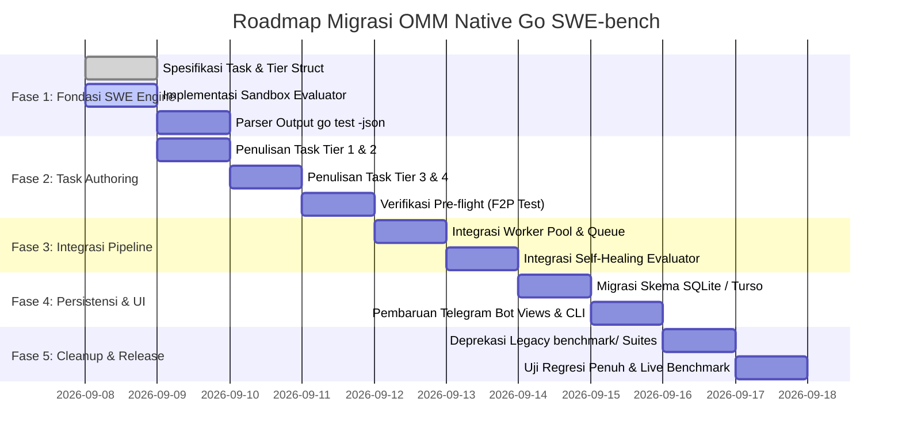

# 🚀 MIGRATION.md — Rencana Migrasi Arsitektur: Generative ke Native Go SWE-bench

> **Dokumen Resmi Migrasi Teknis**  
> **Status:** Disetujui untuk Implementasi  
> **Target Runtime:** Go 1.24+ / Go 1.25+  
> **Basis Kode:** `github.com/dickymuliafiqri/OMM`  
> **Tanggal Efektif:** 2026-09-08  

---

## 1. 📌 Latar Belakang & Rasional Perubahan

### 1.1 Keterbatasan Arsitektur Generatif Lama
Pada implementasi awal OMM, evaluasi dilakukan secara **generatif (greenfield)**: AI diminta menulis server cache HTTP in-memory dari nol di dalam satu file `main.go`. Meskipun prompt telah diubah menjadi berbasis skenario klien (*problem-driven*), hasil pengujian di lapangan menunjukkan kelemahan mendasar:
1. **Rentan Pattern-Matching (Template Memorization):**
   Pola implementasi *sharded cache*, `sync.RWMutex`, `sync/atomic`, dan `signal.Notify` merupakan salah satu kode Go yang paling melimpah di dataset pelatihan LLM. Model dengan parameter menengah (seperti `gemma4:31b`) mampu meraih skor 90–97/100 bukan karena daya nalar sistem yang mendalam, melainkan karena kemampuan menghafal boilerplate umum.
2. **Celah Pengecekan AST Berbasis Teks:**
   Sebagian suite pengujian lama memeriksa string literal (misal `strings.Contains(code, "type shard")` atau `<-ctx.Done()`). Pengecekan ini mudah dipenuhi oleh model kecil tanpa membuktikan bahwa logika konkurensi bekerja secara benar di bawah beban riil.

### 1.2 Visi Baru: OMM Multi-Difficulty SWE-bench (Brownfield Bug-Fixing)
OMM beralih secara penuh ke paradigma **SWE-bench (Software Engineering Benchmark) Native Go**. AI tidak lagi diminta menghasilkan kode dari nol, melainkan **diberikan laporan bug riil (*GitHub issue report*) dan basis kode Go yang mengandung kecacatan (*buggy/broken codebase*)**.

**Keunggulan Paradigma Baru:**
* **Evaluasi Daya Nalar Sistem Riil:** Model dipaksa membaca, mengisolasi akar masalah (*root cause*), dan merevisi kode tanpa merusak kontrak API atau fungsi yang sudah berjalan.
* **Tingkat Kesulitan Bertingkat (4-Tier Ladder):** Membedakan secara tegas kapabilitas model kecil (8B–31B) dengan model flagship penalaran tinggi (Claude Opus, GPT-4o, Gemini Pro).
* **Ekstensibilitas Masa Depan:** Menambahkan kasus uji baru di kemudian hari semudah menambahkan satu file task Go baru tanpa perlu menyentuh mesin evaluasi (*future-proof*).
* **100% Native Go & Bebas Docker:** Evaluasi dijalankan secara ephemeral di sandbox lokal menggunakan Go toolchain bawaan (`go test -race -v -json`), sehingga proses eksekusi sangat cepat (< 30 detik per task) dan cocok untuk UX Telegram Bot.

---

## 2. 🪜 Rubrik Evaluasi: 4-Tier Ladder (Total 100 Poin)

Dalam satu sesi benchmark, AI akan diuji menyelesaikan serangkaian task yang merepresentasikan tingkatan rekayasa perangkat lunak:

```
                               ┌─────────────────────────────┐
                               │   TIER 4: STAFF / EXPERT    │  25 Poin
                               │  Lock-Free, CAS, FSM, Race  │  (Flagship Only)
                               └──────────────┬──────────────┘
                                              │
                               ┌──────────────┴──────────────┐
                               │   TIER 3: SENIOR ENGINEER   │  30 Poin
                               │ Deadlock Inversion, Context │  (Model Pintar)
                               └──────────────┬──────────────┘
                                              │
                               ┌──────────────┴──────────────┐
                               │   TIER 2: MID-LEVEL ENGR    │  25 Poin
                               │  Goroutine Leak, Channels   │  (Mulai Terseleksi)
                               └──────────────┬──────────────┘
                                              │
                               ┌──────────────┴──────────────┐
                               │   TIER 1: JUNIOR ENGINEER   │  20 Poin
                               │ Nil Pointer, Simple Map Race│  (Baseline Model)
                               └─────────────────────────────┘
```

### Rincian Kategori Tier:

| Tier | Level | Bobot | Karakteristik Masalah Go | Target Model |
|:---:|:---|:---:|:---|:---|
| 🟢 **T1** | **Junior** | **20 pts** | Bug logika & keamanan memori dasar: *Nil pointer dereference*, unclosed HTTP response body / file leak, race condition sederhana pada map tanpa mutex. | Semua model $\ge$ 8B harus mampu menyelesaikan ini. |
| 🟡 **T2** | **Mid-Level** | **25 pts** | Bug konkurensi & resource lifecycle: *Goroutine leak* (loop tanpa `<-ctx.Done()`), unbuffered channel yang macet (*goroutine hanging*), mutex lock yang lupa di-unlock pada branch error. | Model kelas 31B mulai terseleksi ketat. |
| 🟠 **T3** | **Senior** | **30 pts** | Masalah arsitektur & sinkronisasi multi-domain: *Lock ordering inversion (Deadlock)*, double-checked locking race, kegagalan propagasi pembatalan context pada worker pool, read-after-delete race window. | Model kecil (<70B) rontok; hanya model penalaran tinggi yang lolos. |
| 🔴 **T4** | **Staff / Expert** | **25 pts** | Masalah performa tinggi, memory ordering & lock-free: *Lock-free atomic CAS ring buffer bug*, starvation pada bounded priority queue, race condition pada finite state machine (FSM). | Hanya model kelas flagship (Claude Opus, GPT-4o, Gemini 2.0 Pro). |

### Gelar Rekayasa (Engineering Titles):
- **Grade S — Staff Engineer (90 – 100 pts):** Menyelesaikan hingga Tier 4 secara sempurna.
- **Grade A — Senior Engineer (75 – 89 pts):** Menyelesaikan Tier 1, 2, dan 3.
- **Grade B — Mid-level Engineer (50 – 74 pts):** Menyelesaikan Tier 1 dan 2.
- **Grade C — Junior Engineer (20 – 49 pts):** Hanya mampu menyelesaikan Tier 1.
- **Grade F — Untrained / Hallucinating (< 20 pts):** Gagal di Tier 1 atau merusak integritas kompilasi/race detector.

---

## 3. 🏗️ Arsitektur Komponen Baru (`internal/swe`)

Struktur folder baru yang menggantikan logika pengujian generatif:

```text
internal/
├── swe/
│   ├── task.go                 # Definisi data model Task, Tier, EvalResult
│   ├── registry.go             # Registry task, kurasi daftar soal, dan fungsi seleksi
│   ├── evaluator.go            # Runner evaluasi native (go test -race -json) di sandbox
│   ├── prompt.go               # Prompt generator (Issue Markdown + Broken Code)
│   └── tasks/                  # Koleksi file implementasi task per kategori
│       ├── t1_nil_pointer.go   # Tier 1: Task nil pointer dereference
│       ├── t1_map_race.go      # Tier 1: Task data race pada map
│       ├── t2_goroutine_leak.go# Tier 2: Task kebocoran goroutine ticker
│       ├── t2_channel_block.go # Tier 2: Task unbuffered channel hang
│       ├── t3_deadlock.go      # Tier 3: Task deadlock transfer saldo (lock inversion)
│       ├── t3_ctx_propagate.go # Tier 3: Task kegagalan context propagation
│       ├── t4_atomic_cas.go    # Tier 4: Task lock-free ring buffer synchronization
│       └── t4_fsm_race.go      # Tier 4: Task concurrent finite state machine
```

### 3.1 Model Data Task (`internal/swe/task.go`)
```go
package swe

type Tier string

const (
	TierJunior Tier = "JUNIOR" // 20 Pts
	TierMid    Tier = "MID"    // 25 Pts
	TierSenior Tier = "SENIOR" // 30 Pts
	TierStaff  Tier = "STAFF"  // 25 Pts
)

// Task mendefinisikan satu unit masalah perbaikan kode (SWE-bench instance)
type Task struct {
	ID         string   `json:"id"`          // Contoh: "swe-t3-deadlock-01"
	Title      string   `json:"title"`       // Contoh: "Deadlock pada Transfer Saldo Bersamaan"
	Tier       Tier     `json:"tier"`        // Junior, Mid, Senior, Staff
	Points     int      `json:"points"`      // Poin jika task terselesaikan penuh
	Category   string   `json:"category"`    // "concurrency", "memory", "deadlock", "atomic"
	IssueBody  string   `json:"issue_body"`  // Markdown laporan bug ala GitHub issue
	BrokenCode string   `json:"broken_code"` // Kode Go awal yang memiliki cacat logika/bug
	TestCode   string   `json:"test_code"`   // File *_test.go yang memvalidasi perbaikan
	TotalTests int      `json:"total_tests"` // Jumlah fungsi Test di dalam TestCode
}

// EvalResult menyimpan status pengujian task
type EvalResult struct {
	TaskID      string        `json:"task_id"`
	Tier        Tier          `json:"tier"`
	Points      int           `json:"points"`
	MaxPoints   int           `json:"max_points"`
	Resolved    bool          `json:"resolved"`
	HasRace     bool          `json:"has_race"`
	CompileErr  string        `json:"compile_err,omitempty"`
	TestOutput  string        `json:"test_output"`
	DurationMs  int64         `json:"duration_ms"`
	Attempts    int           `json:"attempts"`
}
```

### 3.2 Native Sandbox Evaluator (`internal/swe/evaluator.go`)
Evaluator menerapkan prinsip **Fail-to-Pass (F2P)** dengan eksekusi native:
1. **Pre-Flight Validation:** Memastikan bahwa pada kondisi awal (`BrokenCode` + `TestCode`), pengujian `go test` **WAJIB GAGAL**. Jika kode awal sudah lolos, task dianggap invalid.
2. **Execution:** Menulis kode hasil perbaikan AI (`main.go`) dan file uji (`main_test.go`) ke dalam direktori sandbox sementara (`omm-swe-*`).
3. **Pemeriksaan Ketat `-race`:**
   ```bash
   go test -race -v -count=1 -timeout=30s ./...
   ```
4. **Zero-Tolerance Data Race:** Jika seluruh test case lulus namun terdeteksi baris `WARNING: DATA RACE`, skor task otomatis menjadi **0 poin**.

---

## 4. 🔄 Protokol Self-Healing untuk Perbaikan Bug

Mekanisme self-healing multi-turn yang ada di `internal/ai/client.go` diadaptasi untuk menerima pesan kesalahan kompilasi dan log kegagalan unit test:

1. **Percobaan 1 (Zero-Shot):** Jika lolos kompilasi dan semua unit test hijau $\rightarrow$ **100% Poin Task**.
2. **Percobaan 2 (Compiler / Test Failure Feedback):**
   Jika `go test` gagal (misal `FAIL: TestConcurrentTransfer (Deadlock detected)`), pesan kegagalan dikembalikan ke AI (1x feedback):
   ```text
   Your fix failed the verification test with the following output:
   [FAIL / Stderr log]
   Please analyze the failure, fix the issue, and return the COMPLETE updated Go code.
   ```
   Jika berhasil pada percobaan ke-2 $\rightarrow$ **Penalti -20% Poin Task**.
3. **Gagal setelah percobaan ke-2:** Task dinyatakan **Gagal (0 poin)**.

---

## 5. 🗄️ Migrasi Skema Basis Data (LibSQL / Turso)

Struktur tabel diperbarui agar dapat merekam riwayat penyelesaian task SWE-bench secara granular:

```sql
-- 1. Tambahkan kolom mode dan tier level pada benchmark_runs
ALTER TABLE benchmark_runs ADD COLUMN benchmark_mode TEXT DEFAULT 'swe';
ALTER TABLE benchmark_runs ADD COLUMN max_tier_achieved TEXT DEFAULT 'NONE';

-- 2. Buat tabel rincian penyelesaian task SWE
CREATE TABLE IF NOT EXISTS swe_task_runs (
    id TEXT PRIMARY KEY,
    run_id TEXT NOT NULL REFERENCES benchmark_runs(id) ON DELETE CASCADE,
    task_id TEXT NOT NULL,
    task_title TEXT NOT NULL,
    tier TEXT NOT NULL,
    points_awarded INTEGER NOT NULL,
    max_points INTEGER NOT NULL,
    resolved BOOLEAN NOT NULL DEFAULT FALSE,
    has_race BOOLEAN NOT NULL DEFAULT FALSE,
    attempts INTEGER NOT NULL DEFAULT 1,
    test_output TEXT,
    created_at DATETIME DEFAULT CURRENT_TIMESTAMP
);

CREATE INDEX IF NOT EXISTS idx_swe_task_runs_run_id ON swe_task_runs(run_id);
```

---

## 6. 📱 Migrasi Tampilan Telegram Bot & CLI

### 6.1 Desain Scorecard Baru
Pesan hasil evaluasi di Telegram bot diformat ulang dengan visual *Tier Ladder*:

```text
📊 HASIL EVALUASI: ON MY MARK SWE-BENCH 📊
━━━━━━━━━━━━━━━━━━━━━━━━━━━━
🤖 Model: claude-3-5-sonnet
🎯 Skor Akhir: 100 / 100 [Grade S — Staff Engineer]
⏱️ Waktu Evaluasi: 18.4 detik
💵 Efisiensi Biaya: ~$0.0042 USD
🆔 ID Pengujian: 8a7c29e1-32bf-4f2a-9694-df0a19e5d712

Hasil Evaluasi Multi-Tier Ladder:
🟢 Tier 1: Junior (20/20 pts) — [Lolos Turn 1]
   ↳ ✅ Task: Fix Race Condition on Session Map (Bebas Data Race)
🟡 Tier 2: Mid-Level (25/25 pts) — [Lolos Turn 1]
   ↳ ✅ Task: Goroutine Leak & Ticker Cleanup on Service Stop
🟠 Tier 3: Senior (30/30 pts) — [Lolos Turn 2 (Self-Healing)]
   ↳ ✅ Task: Deadlock Elimination in Account Transfer Lock Inversion
🔴 Tier 4: Staff (25/25 pts) — [Lolos Turn 1]
   ↳ ✅ Task: Lock-Free Ring Buffer ABA Prevention via Atomic CAS
━━━━━━━━━━━━━━━━━━━━━━━━━━━━
🏆 Predikat: AI menunjukkan pemahaman arsitektur sistem tingkat tinggi dan mampu menyelesaikan seluruh tantangan bug-fixing konkurensi.
```

---

## 7. 🗓️ Rencana Eksekusi & Tahapan Migrasi (5 Fase)



### Detail Tindakan per Fase:

#### Fase 1: Fondasi SWE Engine (`internal/swe`)
- Buat `internal/swe/task.go`, `internal/swe/registry.go`, dan `internal/swe/evaluator.go`.
- Buat unit test mandiri untuk evaluator: pastikan mampu menangkap `PASS`, `FAIL`, dan `DATA RACE` secara akurat.

#### Fase 2: Kurasi Task Instances (`internal/swe/tasks/`)
- Tulis minimal 2 task untuk setiap Tier (total 8 task awal).
- Setiap task harus memiliki unit test otomatis yang menguji bahwa kode awal **pasti gagal**, dan implementasi solusi referensi **pasti lolos 100%**.

#### Fase 3: Integrasi Pipeline (`internal/queue/pool.go` & `internal/ai/`)
- Sambungkan antrean job di worker pool ke mesin SWE evaluator.
- Terapkan loop eksekusi 4-tier berurutan: jika model gagal di satu tier, evaluasi tetap mencatat skor kumulatif yang berhasil diraih.

#### Fase 4: Persistensi & Presentasi UI
- Terapkan migrasi DDL pada `internal/storage/sqlite_repo.go`.
- Sesuaikan `internal/bot/views.go` untuk merender tampilan kartu skor ladder.
- Perbarui CLI `cmd/cli/main.go` agar mendukung evaluasi SWE-bench secara offline/lokal.

#### Fase 5: Cleanup & Deprekasi
- [x] Selesai: Seluruh modul legacy `internal/benchmark/` telah dihapus dan proyek 100% menggunakan SWE-bench engine.
- [x] Selesai: Dokumentasi `README.md` dan `AGENTS.md` sinkron dengan arsitektur murni SWE-bench.

---

## 8. 🧪 Checklist Kepatuhan & Verifikasi Rekayasa (Sesuai AGENTS.md)

Sebelum setiap fase dianggap tuntas, wajib mematuhi standar verifikasi repositori:

```bash
# 1. Seluruh unit test lolos tanpa data race
go test -race -count=1 ./...

# 2. Bebas dari static analysis warning
go vet ./...

# 3. Seluruh entrypoint biner berhasil dikompilasi
go build ./cmd/bot ./cmd/cli
```

---

*Dokumen ini merupakan panduan arsitektur definitif selama proses migrasi berlangsung.*
