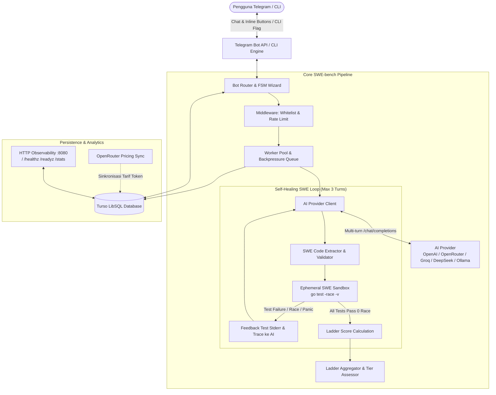

# 🚀 OMM (On My Mark) — Native Go SWE-bench Concurrency Ladder

**OMM (On My Mark)** adalah platform benchmarking dan evaluasi otomatis berkecepatan tinggi yang dirancang khusus untuk menguji kecakapan model AI (*Large Language Models*) dalam mendiagnosis, mengisolasi akar masalah, dan memperbaiki kode backend **Go 1.24+** nyata (*brownfield bug-fixing / Go SWE-bench*).

Berbeda dari benchmark konvensional yang meminta AI membuat kode dari nol (*greenfield boilerplate*), OMM menyajikan **laporan bug riil (*GitHub Issue*)** dan basis kode Go yang bermasalah (*broken codebase*). Model AI dievaluasi melalui **4-Tier Engineering Ladder** (Junior, Mid-Level, Senior, Staff) menggunakan Go toolchain bawaan (`go test -race`) secara 100% native dan bebas dari ketergantungan Docker.

Diakses secara interaktif melalui **Telegram Bot** maupun **CLI Tool**, OMM mengevaluasi kode yang dihasilkan AI secara mekanis di dalam sandbox terisolasi dengan prinsip deterministik **Fail-to-Pass (F2P)**.

---

## 📑 Daftar Isi
- [Arsitektur Sistem](#-arsitektur-sistem)
- [Filosofi SWE-bench & Brownfield Bug-Fixing](#-filosofi-swe-bench--brownfield-bug-fixing)
- [4-Tier Engineering Ladder (Total 100 Poin)](#-4-tier-engineering-ladder-total-100-poin)
- [Self-Healing Test Feedback Loop](#-self-healing-test-feedback-loop)
- [Fitur Utama](#-fitur-utama)
- [Struktur Proyek](#-struktur-proyek)
- [Persyaratan Sistem](#-persyaratan-sistem)
- [Panduan Instalasi & Menjalankan Lokal](#-panduan-instalasi--menjalankan-lokal)
- [Penggunaan Mandiri (CLI Mode)](#-penggunaan-mandiri-cli-mode)
- [Deployment via Docker & VPS](#-deployment-via-docker--vps)
- [Konfigurasi Lingkungan (.env)](#-konfigurasi-lingkungan-env)
- [Daftar Perintah Telegram Bot](#-daftar-perintah-telegram-bot)
- [Observability & Health Check](#-observability--health-check)
- [Lisensi](#-lisensi)

---

## 🏛️ Arsitektur Sistem



---

## 🎯 Filosofi SWE-bench & Brownfield Bug-Fixing

Tolok ukur utama OMM adalah menguji **daya nalar sistem (*systems reasoning*)** dan **kemampuan rekayasa software nyata**:

* **Brownfield Bug-Fixing:** Model AI tidak lagi diminta membuat server dari nol yang rentan dihafal dari data pelatihan (*pretraining contamination*). Sebaliknya, model diberikan issue description, konteks arsitektur, dan file kode yang rusak. Model harus mengisolasi bug tanpa merusak fungsionalitas lain.
* **Prinsip Fail-to-Pass (F2P) Deterministik:** Setiap task memiliki test suite yang ketat. Kode awal (`BrokenCode`) **dijamin gagal**, sedangkan solusi perbaikan (`ReferenceSolution`) **dijamin lolos 100%** tanpa data race.
* **100% Native Go (Zero Docker Overhead):** Pengujian berjalan langsung di sandbox ephemeral menggunakan `go test -race -v -count=1`. Tidak memerlukan daemon Docker atau runtime container yang berat, sehingga benchmark berjalan cepat (< 3-5 detik per task).
* **Multi-Difficulty Differentiation:** Membedakan secara tegas kapabilitas model kecil (8B–31B) dengan model penalaran *flagship* (o3-mini, Claude 3.7 Sonnet, GPT-4o, DeepSeek-R1).

---

## 📊 4-Tier Engineering Ladder (Total 100 Poin)

| Tier | Level Target | Bobot | Karakteristik Masalah | Deskripsi Kasus Uji |
|:---|:---|:---:|:---|:---|
| **Tier 1** | **Junior** | **20 pts** | Nil Pointer & Map Race | Memperbaiki dereference pointer nil pada cache session atau data race pada pembacaan/penulisan map simultan. |
| **Tier 2** | **Mid-Level** | **25 pts** | Goroutine Leak & Channel Hang | Mengatasi goroutine yang menggantung pada unbuffered channel atau background ticker yang tidak dihentikan saat context dibatalkan. |
| **Tier 3** | **Senior** | **30 pts** | Deadlock & Context Propagation | Mengurai deadlock transfer saldo antar akun (lock inversion AB-BA) dan memastikan pembatalan context merambat ke seluruh child worker. |
| **Tier 4** | **Staff** | **25 pts** | Lock-Free CAS & State Machine | Memperbaiki race condition / stale read pada lock-free atomic CAS queue dan concurrent transition race pada finite state machine pesanan. |
| **Total** | | **100 pts** | | **Predikat: Grade S (≥90), A (≥80), B (≥70), C (≥60), F (<60)** |

### Skala Penalti Self-Healing:
- **Percobaan ke-1 (Turn 1):** Multiplier **1.0** (100% poin maksimal, misal Tier 3 = 30 pts).
- **Percobaan ke-2 (Turn 2 / 1x Feedback):** Multiplier **0.8** (80% poin maksimal, misal Tier 3 = 24 pts).
- **Gagal setelah 2 Percobaan:** **0 pts**.

### Predikat Nilai (*Engineering Levels*):
- **Grade S (Staff Engineer):** 90 – 100 pts (Sangat Direkomendasikan / Menguasai Sistem & Lock-Free Concurrency)
- **Grade A (Senior Engineer):** 80 – 89 pts (Handal / Menyelesaikan Deadlock & Lifecycle Kompleks)
- **Grade B (Mid-Level Engineer):** 70 – 79 pts (Kompeten / Mampu Mengatasi Race Condition Standar)
- **Grade C (Junior Engineer):** 60 – 69 pts (Dasar / Memahami Sintaks dan Nil Check Dasar)
- **Grade F (Unqualified):** < 60 pts (Gagal / Tidak Lolos Kasus Uji Konkurensi Kritis)

---

## 🔄 Self-Healing Test Feedback Loop

Jika kode perbaikan yang dihasilkan model AI gagal saat dijalankan terhadap test suite, OMM tidak langsung menggugurkan pengujian. Sistem menerapkan mekanisme **Self-Healing Feedback Loop**:

1. **Ekstraksi Kode Go:** Mengambil blok kode lengkap ` ```go ... ``` ` yang dihasilkan AI.
2. **Audit Keamanan AST Statis:** Memastikan kode tidak mengimpor paket berbahaya (`os/exec`, `syscall`, `unsafe`, dll.).
3. **Uji Live dengan Race Detector:** Menjalankan `go test -race -v -count=1` di direktori sementara unik (`omm-swe-*`).
4. **Koreksi Multi-turn:** Jika pengujian gagal (test failure, panic, timeout, atau `DATA RACE`), output log dan stack trace dikirim kembali ke AI dalam konteks percakapan multi-turn.
5. **Akumulasi Token & Biaya:** Token masukan (*prompt*) dan keluaran (*completion*) diakumulasikan dari seluruh putaran percakapan untuk memastikan kalkulasi biaya akurat.

---

## ✨ Fitur Utama

- 🧩 **Brownfield SWE-bench Tasks**: Berisi 8 kasus bug konkurensi dunia nyata yang terkurasi ketat dengan prinsip Fail-to-Pass (F2P).
- 🪜 **4-Tier Engineering Ladder**: Evaluasi berjenjang dari Junior (20 pts), Mid-Level (25 pts), Senior (30 pts), hingga Staff Engineer (25 pts).
- 🔄 **Self-Healing Test Loop**: Memberikan feedback kompilasi dan race detector ke AI maksimal 1 kali umpan balik (maksimal 2 percobaan) dengan penalti bertingkat (1.0 / 0.8 / gagal = 0).
- 🏆 **Leaderboard Berdasarkan Skor Tertinggi**: Model diperingkat berdasarkan skor puncaknya (*peak performance*) dan tier tertinggi yang berhasil diselesaikan (*Max Tier*).
- 💵 **Estimasi Biaya Riil & Sinkronisasi Tarif**:
  - Mengakumulasikan token input dan output di seluruh putaran self-healing.
  - Sinkronisasi berkala tarif harga token resmi dari API OpenRouter ke database Turso.
- 🔑 **Manajemen Kredensial Mandiri**:
  - Kredensial pengguna (`Base URL` dan `API Key`) disimpan aman di database Turso untuk kemudahan benchmark berulang.
  - Fitur penghapusan kredensial instan kapan saja via `/resetkey` atau tombol inline keyboard.
  - Pesan teks berisi API Key langsung dihapus otomatis dari chat history Telegram demi keamanan visual.
- 🤖 **Dynamic Model Picker & Ping Test**:
  - Pengambilan otomatis daftar model dari endpoint `GET /models` penyedia AI.
  - Paginasi interaktif inline keyboard (`⬅️ Prev`, `📄 X/Y`, `➡️ Next`).
  - Validasi *Ping Test* sebelum memulai benchmark untuk memastikan endpoint dan kredensial aktif.
- 🛡️ **AST Security Guard**: Pemindaian pohon sintaksis statis sebelum kompilasi untuk memblokir paket berbahaya (`os/exec`, `syscall`, `unsafe`, `plugin`, `runtime/cgo`, `C`).
- ⚡ **Zero-Docker Ephemeral Sandbox**: Pengujian dijalankan langsung melalui subproses native Go dengan isolasi direktori sementara dan timeout ketat.
- 🚦 **Worker Pool & Backpressure Queue**: Eksekusi pengujian dibatasi oleh antrean terkontrol dengan *progress throttling* (1.5 detik) agar tidak memicu rate limit pesan Telegram (HTTP 429).
- 📥 **Ekspor Laporan & Scorecard**: Pengguna menerima kartu skor visual Telegram lengkap dengan status kelulusan tiap tier dan task.

---

## 📁 Struktur Proyek

```text
OMM/
├── cmd/
│   ├── bot/
│   │   └── main.go                 # Entrypoint bot Telegram & server observabilitas
│   └── cli/
│       └── main.go                 # Tool CLI SWE-bench & verifikasi F2P lokal
├── internal/
│   ├── ai/                         # Klien AI, prompt problem-driven, multi-turn loop
│   │   ├── client.go               # Universal OpenAI/OpenRouter client & multi-turn Chat API
│   │   ├── extractor.go            # Pembersih markdown & ekstraktor kode Go
│   │   └── prompt.go               # Prompt standar evaluasi
│   ├── swe/                        # Mesin evaluasi SWE-bench & ladder
│   │   ├── task.go                 # Definisi Task, Tier, EvalResult, LadderReport
│   │   ├── registry.go             # Registry task kurasi & fungsi default ladder
│   │   ├── evaluator.go            # Ephemeral test runner (go test -race) & F2P validator
│   │   ├── prompt.go               # Prompt builder (Issue Markdown + Broken Code) & extractor
│   │   └── tasks/                  # Kasus uji bug riil terkurasi
│   │       ├── t1_nil_pointer.go   # Tier 1: Nil pointer dereference pada session cache
│   │       ├── t1_map_race.go      # Tier 1: Concurrent map data race
│   │       ├── t2_goroutine_leak.go# Tier 2: Kebocoran goroutine & unstopped ticker
│   │       ├── t2_channel_block.go # Tier 2: Goroutine hang pada unbuffered channel
│   │       ├── t3_deadlock.go      # Tier 3: Deadlock transfer saldo (lock inversion)
│   │       ├── t3_ctx_propagate.go # Tier 3: Kegagalan propagasi pembatalan context
│   │       ├── t4_atomic_cas.go    # Tier 4: Race condition & stale read lock-free queue
│   │       └── t4_fsm_race.go      # Tier 4: Concurrent order state machine race
│   ├── bot/                        # Telegram router, wizard FSM, views & keyboards
│   ├── config/                     # Parser variabel lingkungan (.env)
│   ├── health/                     # HTTP health server (:8080 /, /healthz, /readyz, /stats)
│   ├── pricing/                    # Kalkulasi biaya token & auto-sync OpenRouter
│   ├── queue/                      # Worker pool, job deduplikasi, progress throttler
│   ├── sandbox/                    # AST security guard, dynamic port, ephemeral runner
│   └── storage/                    # Driver Turso LibSQL, migrasi, dan query leaderboard
├── pkg/
│   └── logger/                     # Structured 1-line logger dengan masking rahasia
├── Dockerfile                      # Multi-stage production container
├── docker-compose.yml              # Konfigurasi deployment docker compose
├── go.mod                          # Go module dependencies
├── .env.example                    # Template konfigurasi environment
├── AGENTS.md                       # Panduan arsitektur komprehensif untuk AI Agent
├── MIGRATION.md                    # Roadmap migrasi arsitektur ke Go SWE-bench
└── README.md                       # Dokumentasi utama proyek
```

---

## 💻 Persyaratan Sistem

- **Go**: Versi 1.24 atau lebih baru (dengan GCC / CGO aktif untuk `-race`).
- **Database**: Akun [Turso LibSQL](https://turso.tech/) (atau SQLite lokal).
- **Telegram Bot**: Token bot yang diperoleh dari [@BotFather](https://t.me/BotFather).
- **Docker & Docker Compose** (opsional untuk deployment server).

---

## 🚀 Panduan Instalasi & Menjalankan Lokal

### 1. Kloning Repositori & Persiapkan Environment
```bash
git clone https://github.com/dickymuliafiqri/OMM.git
cd OMM
cp .env.example .env
```

Edit file `.env` dan isi token Telegram Anda serta kredensial database:
```env
TELEGRAM_BOT_TOKEN="123456789:ABCdefGhIJKlmNoPQRsTUVwxyZ"
BOT_ADMIN_IDS="12345678"
TURSO_DATABASE_URL="libsql://your-db-name.turso.io"
TURSO_AUTH_TOKEN="your-turso-auth-token"
```

### 2. Jalankan Seluruh Unit Test
```bash
go test -v -count=1 ./...
```

### 3. Jalankan Telegram Bot
```bash
go run ./cmd/bot
```

Bot akan segera aktif dan mulai menerima pesan dari pengguna Telegram.

---

## 🖥️ Penggunaan Mandiri (CLI Mode)

Selain bot Telegram, evaluasi model dan validasi task dapat dijalankan secara lokal melalui CLI:

```bash
# 1. Uji kepatuhan Fail-to-Pass (F2P) pada seluruh task terkurasi
go run ./cmd/cli -verify-all

# 2. Uji ladder 4-tier lokal menggunakan reference solution (benchmark mandiri)
go run ./cmd/cli -ladder

# 3. Uji model AI langsung terhadap 4-Tier Ladder SWE-bench
go run ./cmd/cli -ladder -url "https://api.openai.com/v1" -key "sk-..." -model "gpt-4o"

# 4. Uji task spesifik dengan model AI
go run ./cmd/cli -task "swe-t1-nil-pointer-01" -url "https://api.groq.com/openai/v1" -key "gsk_..." -model "llama-3.3-70b-versatile"

# 5. Uji file solusi Go lokal terhadap task tertentu
go run ./cmd/cli -task "swe-t1-nil-pointer-01" -file "path/to/solution.go"
```

---

## 🐳 Deployment via Docker & VPS

Aplikasi telah dilengkapi dengan `Dockerfile` multi-stage berbasis Debian Slim yang memuat Go compiler dan `gcc` sehingga race detector (`-race`) dapat bekerja tanpa kendala di dalam container.

### 1. Build & Jalankan dengan Docker Compose
```bash
docker compose up -d --build
```

### 2. Periksa Status Kontainer & Log
```bash
# Cek log aplikasi
docker compose logs -f benchmark-bot

# Cek status kesehatan container
docker compose ps
```

### 3. Verifikasi Endpoint Health Check & Overview
```bash
curl http://localhost:8080/
curl http://localhost:8080/healthz
```

---

## ⚙️ Konfigurasi Lingkungan (.env)

| Variabel | Tipe | Default | Deskripsi |
|:---|:---:|:---:|:---|
| `TELEGRAM_BOT_TOKEN` | String | *Wajib* | Token bot Telegram dari @BotFather. |
| `BOT_ADMIN_IDS` | String | `""` | Daftar Telegram ID admin (pisahkan koma: `123,456`). |
| `TURSO_DATABASE_URL` | String | `:memory:` | URL LibSQL Turso (`libsql://...`) atau file SQLite lokal. |
| `TURSO_AUTH_TOKEN` | String | `""` | Token autentikasi database Turso. |
| `MAX_CONCURRENT_WORKERS` | Int | `3` | Jumlah worker goroutine paralel untuk sandbox. |
| `MAX_QUEUE_SIZE` | Int | `20` | Kapasitas antrean sebelum backpressure (`ErrQueueFull`). |
| `PER_USER_HOURLY_LIMIT` | Int | `5` | Batas maksimum benchmark per pengguna dalam 1 jam. |
| `HEALTH_CHECK_PORT` | Int | `8080` | Port HTTP internal untuk `/`, `/healthz`, `/readyz`, dan `/stats`. |
| `WHITELIST_MODE` | Bool | `false` | Jika `true`, hanya ID dalam whitelist/admin yang dapat mengakses bot. |
| `WHITELIST_USER_IDS` | String | `""` | Daftar Telegram ID yang diizinkan saat whitelist aktif. |

---

## 🤖 Daftar Perintah Telegram Bot

### Perintah Pengguna Publik
- `/start` — Menampilkan salam pembuka, kebijakan privasi kredensial, dan tombol navigasi utama.
- `/help` — Panduan penggunaan dan rubrik penilaian detail 4-Tier SWE-bench Ladder (100 poin).
- `/benchmark` — Memulai wizard interaktif (kredensial tersimpan, pilih preset URL, fetch `/models`, validasi ping test).
- `/resetkey` — Menghapus kredensial API Key dan Base URL yang tersimpan di database.
- `/leaderboard` — Melihat peringkat model AI terbaik berdasarkan Skor Tertinggi dan Efisiensi Biaya.
- `/history` — Melihat riwayat pengujian akun pengguna dan mengunduh laporan CSV/kode Go.
- `/cancel` — Membatalkan sesi form wizard yang sedang aktif.

### Perintah Khusus Admin (`BOT_ADMIN_IDS`)
- `/admin` atau `/admin help` — Menampilkan menu bantuan administrasi.
- `/admin stats` — Melihat statistik performa, error rate, beban antrean, dan uptime.
- `/admin ban <telegram_id>` — Memblokir pengguna dari sistem.
- `/admin unban <telegram_id>` — Mencabut status blokir pengguna.
- `/admin resetquota <telegram_id>` — Mereset batas kuota penggunaan per jam milik pengguna.

---

## 🩺 Observability & Health Check

Server HTTP bawaan menyediakan endpoint observabilitas:
- `GET /healthz` — Liveness probe (memeriksa konektivitas basis data dan queue).
- `GET /readyz` — Readiness probe untuk orkestrator kontainer / Kubernetes.
- `GET /stats` — Metrik statistik performa agregat dalam format JSON.

---

## 📜 Lisensi
Didistribusikan di bawah lisensi MIT. Silakan gunakan dan kembangkan secara bebas untuk keperluan evaluasi model AI Anda.
