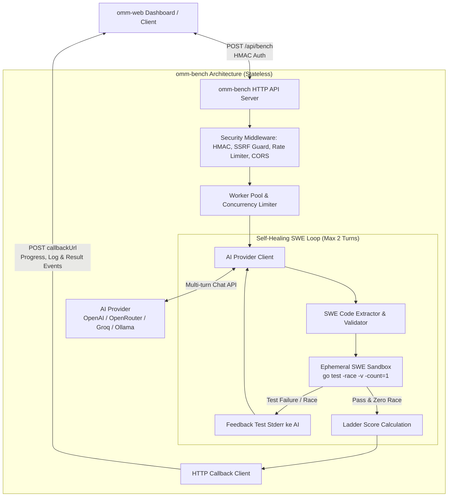

# 🚀 OMM (On My Mark) — Native Go SWE-bench Concurrency Ladder API Server

**OMM (On My Mark)** adalah platform benchmarking dan evaluasi otomatis berkecepatan tinggi yang dirancang khusus untuk menguji kecakapan model AI (*Large Language Models*) dalam mendiagnosis, mengisolasi akar masalah, dan memperbaiki kode backend **Go 1.24+** nyata (*brownfield bug-fixing / Go SWE-bench*).

Berbeda dari benchmark konvensional yang meminta AI membuat kode dari nol (*greenfield boilerplate*), OMM menyajikan **laporan bug riil (*GitHub Issue*)** dan basis kode Go yang bermasalah (*broken codebase*). Model AI dievaluasi melalui **4-Tier Engineering Ladder** (Junior, Mid-Level, Senior, Staff) menggunakan Go toolchain bawaan (`go test -race`) secara 100% native dan bebas dari ketergantungan Docker.

OMM berfungsi sebagai **stateless HTTP API benchmark server** (`omm-bench`) murni yang menerima permintaan evaluasi dari dashboard web (`omm-web`) dan mengirimkan pembaruan progres serta hasil akhir via HTTP callback.

---

## 📑 Daftar Isi
- [Arsitektur Sistem](#-arsitektur-sistem)
- [Filosofi SWE-bench & Brownfield Bug-Fixing](#-filosofi-swe-bench--brownfield-bug-fixing)
- [4-Tier Engineering Ladder (Total 100 Poin)](#-4-tier-engineering-ladder-total-100-poin)
- [Self-Healing Test Feedback Loop](#-self-healing-test-feedback-loop)
- [Fitur Utama](#-fitur-utama)
- [Struktur Proyek](#-struktur-proyek)
- [Persyaratan Sistem](#-persyaratan-sistem)
- [Dokumentasi HTTP API Server](#-dokumentasi-http-api-server)
- [Protokol HTTP Callback](#-protokol-http-callback)
- [Panduan Deployment & Kontainerisasi](#-panduan-deployment--kontainerisasi)
- [Verifikasi & Pengujian](#-verifikasi--pengujian)
- [Konfigurasi Lingkungan (.env)](#-konfigurasi-lingkungan-env)
- [Lisensi](#-lisensi)

---

## 🏛️ Arsitektur Sistem



---

## 🎯 Filosofi SWE-bench & Brownfield Bug-Fixing

Tolok ukur utama OMM adalah menguji **daya nalar sistem (*systems reasoning*)** dan **kemampuan rekayasa software nyata**:

* **Brownfield Bug-Fixing:** Model AI tidak lagi diminta membuat server dari nol yang rentan dihafal dari data pelatihan (*pretraining contamination*). Sebaliknya, model diberikan issue description, konteks arsitektur, dan file kode yang rusak. Model harus mengisolasi bug tanpa merusak fungsionalitas lain.
* **Prinsip Fail-to-Pass (F2P) Deterministik:** Setiap task memiliki test suite yang ketat. Kode awal (`BrokenCode`) **dijamin gagal**, sedangkan solusi perbaikan (`ReferenceSolution`) **dijamin lolos 100%** tanpa data race.
* **100% Native Go (Zero Docker Overhead):** Pengujian berjalan langsung di sandbox ephemeral menggunakan `go test -race -v -count=1`. Tidak memerlukan daemon Docker atau container runtime yang berat, sehingga benchmark berjalan cepat (< 3-5 detik per task).
* **Multi-Difficulty Differentiation:** Membedakan secara tegas kapabilitas model kecil (8B–31B) dengan model penalaran *flagship* (Claude 3.7 Sonnet, GPT-4o, DeepSeek-R1).

---

## 📊 4-Tier Engineering Ladder (Total 100 Poin)

| Tier | Level Target | Bobot | Karakteristik Masalah | Deskripsi Kasus Uji |
|:---|:---|:---:|:---|:---|
| **Tier 1** | **Junior** | **20 pts** | Nil Pointer & Map Race | Memperbaiki dereference pointer nil pada cache session atau data race pada pembacaan/penulisan map simultan. |
| **Tier 2** | **Mid-Level** | **25 pts** | Goroutine Leak & Channel Hang | Mengatasi goroutine yang menggantung pada unbuffered channel atau background ticker yang tidak dihentikan saat context dibatalkan. |
| **Tier 3** | **Senior** | **30 pts** | Deadlock & Context Propagation | Mengurai deadlock transfer saldo antar akun (lock inversion AB-BA) dan memastikan pembatalan context merambat ke seluruh child worker. |
| **Tier 4** | **Staff** | **25 pts** | Lock-Free CAS & State Machine | Memperbaiki race condition / stale read pada lock-free atomic CAS queue dan concurrent transition race pada finite state machine pesanan. |
| **Total** | | **100 pts** | | **Predikat: Grade S (≥90), A (≥80), B (≥70), C (≥60), F (<60)** |

### Skala Penalti Self-Healing:
- **Percobaan ke-1 (Turn 1):** Multiplier **1.0** (100% poin maksimal, misal Tier 3 = 30 pts).
- **Percobaan ke-2 (Turn 2 / 1x Feedback):** Multiplier **0.8** (80% poin maksimal, misal Tier 3 = 24 pts).
- **Gagal setelah 2 Percobaan:** **0 pts**.

### Predikat Nilai (*Engineering Levels*):
- **Grade S (Staff Engineer):** 90 – 100 pts (Sangat Direkomendasikan / Menguasai Sistem & Lock-Free Concurrency)
- **Grade A (Senior Engineer):** 80 – 89 pts (Handal / Menyelesaikan Deadlock & Lifecycle Kompleks)
- **Grade B (Mid-Level Engineer):** 70 – 79 pts (Kompeten / Mampu Mengatasi Race Condition Standar)
- **Grade C (Junior Engineer):** 60 – 69 pts (Dasar / Memahami Sintaks dan Nil Check Dasar)
- **Grade F (Unqualified):** < 60 pts (Gagal / Tidak Lolos Kasus Uji Konkurensi Kritis)

---

## 🔄 Self-Healing Test Feedback Loop

Jika kode perbaikan yang dihasilkan model AI gagal saat dijalankan terhadap test suite, OMM tidak langsung menggugurkan pengujian:

1. **Ekstraksi Kode Go:** Mengambil blok kode lengkap ` ```go ... ``` ` yang dihasilkan AI.
2. **Audit Keamanan AST Statis:** Memastikan kode tidak mengimpor paket berbahaya (`os/exec`, `syscall`, `unsafe`, dll.).
3. **Uji Live dengan Race Detector:** Menjalankan `go test -race -v -count=1` di direktori sementara unik (`omm-sandbox-*`).
4. **Koreksi Multi-turn:** Jika pengujian gagal (test failure, panic, timeout, atau `DATA RACE`), output log dan stack trace dikirim kembali ke AI dalam konteks percakapan multi-turn (maksimal 1 kali umpan balik).
5. **Akumulasi Token & Biaya:** Token masukan (*prompt*) dan keluaran (*completion*) diakumulasikan dari seluruh putaran percakapan.

---

## ✨ Fitur Utama

- 🧩 **Brownfield SWE-bench Tasks**: Berisi 8 kasus bug konkurensi dunia nyata yang terkurasi ketat dengan prinsip Fail-to-Pass (F2P).
- 🪜 **4-Tier Engineering Ladder**: Evaluasi berjenjang dari Junior (20 pts), Mid-Level (25 pts), Senior (30 pts), hingga Staff Engineer (25 pts).
- 🔄 **Self-Healing Test Loop**: Memberikan feedback kompilasi dan race detector ke AI maksimal 1 kali umpan balik (maksimal 2 percobaan) dengan penalti bertingkat (1.0 / 0.8 / gagal = 0).
- 🛡️ **AST Security Guard**: Pemindaian pohon sintaksis statis sebelum kompilasi untuk memblokir paket berbahaya (`os/exec`, `syscall`, `unsafe`, `plugin`, `runtime/cgo`, `C`).
- ⚡ **Zero-Docker Ephemeral Sandbox**: Pengujian dijalankan langsung melalui subproses native Go dengan isolasi direktori sementara dan timeout ketat.
- 🔒 **High Security Posture**: Autentikasi HMAC shared secret, proteksi SSRF terhadap callback dan base URL, token bucket rate limiter, dan zero-persistence API keys.

---

## 📁 Struktur Proyek

```text
OMM/
├── cmd/
│   └── bench/                      # Entrypoint: HTTP API benchmark server
│       └── main.go
├── internal/
│   ├── ai/                         # Klien AI, prompt problem-driven, multi-turn loop
│   │   ├── client.go               # Universal OpenAI/OpenRouter client & multi-turn Chat API
│   │   ├── extractor.go            # Pembersih markdown & ekstraktor kode Go
│   │   └── prompt.go               # Prompt standar evaluasi
│   ├── config/                     # Config parser server minimalis
│   │   └── config.go               # Parser konfigurasi env vars
│   ├── metrics/                    # Metrik performa in-memory
│   │   └── metrics.go              # Counter, Gauge, Timer metrics collector
│   ├── server/                     # HTTP router, handlers, middleware security
│   │   ├── router.go               # HTTP routing multiplexer (net/http standar)
│   │   ├── handler_bench.go        # POST /api/bench handler
│   │   ├── handler_health.go       # GET /healthz, /readyz handler
│   │   ├── handler_root.go         # GET / root landing handler
│   │   ├── handler_status.go       # GET /api/bench/status handler
│   │   ├── middleware_auth.go      # Autentikasi HMAC shared secret
│   │   ├── middleware_cors.go      # CORS whitelist handler
│   │   ├── middleware_logging.go   # Structured request logging middleware
│   │   ├── middleware_ratelimit.go # Token bucket rate limiter
│   │   ├── middleware_security.go  # Security headers (nosniff, no-cache, DENY)
│   │   ├── middleware_validate.go  # Request validation & 1MB body limit
│   │   └── ssrf.go                 # SSRF protection validator
│   ├── worker/                     # Worker pool, ladder runner, callback client
│   │   ├── pool.go                 # Semaphore-based worker pool & graceful shutdown
│   │   ├── job.go                  # Definisi data model pekerjaan benchmark
│   │   ├── executor.go             # Orkestrasi siklus hidup evaluasi
│   │   ├── ladder.go               # 4-tier ladder runner & self-healing loop
│   │   ├── callback.go             # HTTP callback client dengan exponential retry
│   │   └── cost.go                 # Estimasi biaya token fallback
│   ├── swe/                        # Mesin evaluasi SWE-bench & ladder
│   │   ├── task.go                 # Definisi Task, Tier, EvalResult, LadderReport
│   │   ├── registry.go             # Registry task kurasi & fungsi default ladder
│   │   ├── evaluator.go            # Ephemeral test runner (go test -race) & F2P validator
│   │   ├── prompt.go               # Prompt builder (Issue Markdown + Broken Code) & extractor
│   │   └── tasks/                  # Kasus uji bug riil terkurasi (8 task)
│   │       ├── t1_inventory_cache.go
│   │       ├── t1_order_validator.go
│   │       ├── t2_rate_limiter.go
│   │       ├── t2_worker_pool.go
│   │       ├── t3_connection_pool.go
│   │       ├── t3_distributed_cache.go
│   │       ├── t4_mpmc_ring.go
│   │       └── t4_saga_orchestrator.go
│   └── sandbox/                    # AST security guard, dynamic port, ephemeral runner
│       ├── ast_guard.go            # AST static analysis: blokir RCE
│       ├── port.go                 # Dynamic port allocator
│       └── runner.go               # Ephemeral sandbox runner
├── pkg/
│   └── logger/                     # Structured 1-line logger dengan masking rahasia
├── Dockerfile                      # Multi-stage production container (non-root)
├── docker-compose.yml              # Konfigurasi orkestrasi container
├── .dockerignore                   # Pola berkas yang diabaikan saat docker build
├── go.mod                          # Go module (100% standard library)
├── go.sum
├── .env.example                    # Template konfigurasi environment
├── AGENTS.md                       # Panduan arsitektur komprehensif untuk AI Agent
├── MIGRATION.md                    # Roadmap migrasi arsitektur
├── README.md                       # Dokumentasi utama proyek
└── TODO.md                         # Rencana kerja pengembangan benchmark server
```

---

## 💻 Persyaratan Sistem

- **Go**: Versi 1.24 atau lebih baru (dengan GCC / CGO aktif untuk `-race`).
- **OS**: Linux, macOS, atau Windows.

---

## 🌐 Dokumentasi HTTP API Server

`omm-bench` mengekspos endpoint HTTP RESTful berkinerja tinggi berbasis standard library `net/http` dengan zero external dependencies.

### 1. Header Autentikasi & Keamanan
Semua endpoint di bawah `/api/` (kecuali probe health check) mewajibkan otorisasi menggunakan Bearer token yang dicocokkan terhadap `OMM_BENCH_SECRET` melalui *constant-time comparison* (`crypto/subtle`):

```http
Authorization: Bearer <OMM_BENCH_SECRET>
Content-Type: application/json
```

### 2. Endpoints

#### `POST /api/bench`
Mendaftarkan pekerjaan evaluasi benchmark baru ke dalam antrean worker pool.

- **Request Body (JSON, max 1MB):**
```json
{
  "runId": "run-2026-09-08-001",
  "source": "omm-web",
  "callbackUrl": "https://omm-web.example.com/api/callbacks/bench",
  "provider": "openrouter",
  "model": "anthropic/claude-3.5-sonnet",
  "apiKey": "sk-or-v1-...",
  "baseUrl": "https://openrouter.ai/api/v1",
  "streamLogs": true
}
```

| Field | Tipe | Wajib | Keterangan |
|:---|:---:|:---:|:---|
| `runId` | string | Ya | Identifier unik eksekusi benchmark. |
| `source` | string | Ya | Asal pemanggil untuk penandaan dan per-source rate limiting. |
| `callbackUrl` | string | Ya | URL webhook callback untuk laporan progres dan hasil (terlindungi proteksi SSRF). |
| `provider` | string | Ya | Nama provider AI (`openai`, `openrouter`, `ollama`, `groq`, dll.). |
| `model` | string | Ya | Model identifier (contoh: `gpt-4o`, `deepseek/deepseek-r1`). |
| `apiKey` | string | Opsional | Kunci API (dikosongkan untuk model lokal/Ollama; tidak pernah di-log & zeroed in-memory). |
| `baseUrl` | string | Opsional | URL dasar provider API (terlindungi proteksi SSRF). |
| `streamLogs` | bool | Opsional | Jika `true`, mengirimkan callback `log` untuk tiap task yang selesai. |

- **Response Codes:**
  - `202 Accepted`: Job berhasil diverifikasi dan diterima ke dalam antrean.
    ```json
    {
      "status": "accepted",
      "jobId": "run-2026-09-08-001",
      "message": "Benchmark job queued successfully"
    }
    ```
  - `400 Bad Request`: Payload JSON tidak valid, field wajib kosong, atau pelanggaran SSRF pada URL.
  - `401 Unauthorized`: Header `Authorization` tidak ada atau secret token salah.
  - `413 Request Entity Too Large`: Ukuran body request melebihi batas 1MB.
  - `429 Too Many Requests`: Melebihi kuota rate limit global atau per-source.
  - `503 Service Unavailable`: Antrean worker pool penuh (kapasitas maksimum tercapai).

#### `GET /api/bench/status`
Memeriksa status utilisasi worker pool dan kapasitas antrean saat ini.

- **Response (`200 OK`):**
```json
{
  "activeJobs": 1,
  "maxJobs": 3,
  "queueCapacity": 6,
  "queueAvailable": 5
}
```

#### `GET /`
Endpoint landing / penemuan layanan yang mengembalikan metadata server dan daftar rute yang tersedia. Endpoint ini bersifat publik (tanpa autentikasi).

- **Response (`200 OK`):**
```json
{
  "name": "OMM Benchmark Server",
  "service": "omm-bench",
  "version": "1.0.0",
  "status": "running",
  "uptime": "2h30m15s",
  "description": "Stateless Native Go SWE-bench Concurrency Ladder API Server",
  "endpoints": {
    "root": "GET /",
    "health": "GET /healthz",
    "ready": "GET /readyz",
    "bench": "POST /api/bench",
    "status": "GET /api/bench/status"
  }
}
```

#### `GET /healthz` & `GET /readyz`
Probe liveness dan readiness untuk Kubernetes / Docker / load balancer. Endpoint ini bersifat publik (tanpa autentikasi).

- **`GET /healthz` (`200 OK`):**
```json
{"status":"ok"}
```
- **`GET /readyz` (`200 OK` atau `503 Service Unavailable`):**
```json
{"status":"ready"}
```

---

## 📡 Protokol HTTP Callback

Selama evaluasi berlangsung secara asinkron di worker pool, `omm-bench` mengirimkan event HTTP POST secara real-time ke `callbackUrl` klien:

### 1. Event `progress`
Dikirim pada setiap transisi tahapan ladder (inisialisasi, tiap tier, kalkulasi hasil).
```json
{
  "type": "progress",
  "jobId": "run-2026-09-08-001",
  "stage": "t1_junior",
  "progress": 25,
  "detail": "Evaluating Tier 1: Junior"
}
```

### 2. Event `log`
Dikirim setiap kali sebuah task pengujian selesai dievaluasi (jika `streamLogs: true`).
```json
{
  "type": "log",
  "jobId": "run-2026-09-08-001",
  "taskId": "swe-t1-order-validator-01",
  "tier": "JUNIOR",
  "resolved": true,
  "hasRace": false,
  "attempts": 1,
  "points": 20,
  "maxPoints": 20,
  "durationMs": 2341
}
```

### 3. Event `result`
Dikirim setelah seluruh ladder selesai dievaluasi dengan skor total, laporan komprehensif, dan estimasi biaya token.
```json
{
  "type": "result",
  "jobId": "run-2026-09-08-001",
  "totalPoints": 95,
  "maxPoints": 100,
  "grade": "Grade S (Staff Engineer)",
  "totalDurationMs": 28450,
  "totalPromptTokens": 14200,
  "totalCompletionTokens": 3100,
  "estimatedCostUsd": 0.0452,
  "report": {
    "total_score": 95,
    "max_score": 100,
    "grade": "Grade S (Staff Engineer)",
    "tier_results": []
  }
}
```

### 4. Event `error`
Dikirim apabila terjadi kegagalan fatal (timeout evaluasi, kegagalan fatal worker).
```json
{
  "type": "error",
  "jobId": "run-2026-09-08-001",
  "error": "evaluation timeout reached after 300s"
}
```

> **Keandalan Callback:** Klien callback dilengkapi mekanisme retry otomatis (3x percobaan dengan backoff eksponensial dan timeout per-request 10 detik).

---

## 🐳 Panduan Deployment & Kontainerisasi

### 1. Menjalankan dengan Docker Compose (Direkomendasikan)
OMM menyediakan multi-stage `Dockerfile` dengan non-root user (`appuser:10001`), resource limits (2 CPU, 2GB RAM), dan built-in healthcheck:

```bash
# Salin konfigurasi environment
cp .env.example .env

# Jalankan server via Docker Compose
docker compose up -d --build

# Periksa status container dan health check
docker compose ps

# Periksa log server
docker compose logs -f omm-bench
```

### 2. Menjalankan Binary Native (Bare Metal / VM)
OMM 100% menggunakan pustaka standar Go tanpa library pihak ketiga:

```bash
# 1. Kompilasi binary server
go build -o omm-bench ./cmd/bench

# 2. Atur environment variables wajib
export OMM_LISTEN_ADDR=":9090"
export OMM_BENCH_SECRET="generate-a-secure-random-secret-key-here"

# 3. Jalankan server
./omm-bench
```

---

## 🧪 Verifikasi & Pengujian

Sebagai server benchmark murni, seluruh evaluasi fungsional dan keamanan diverifikasi melalui Go testing toolchain:

```bash
# 1. Jalankan seluruh unit & integration test (termasuk verifikasi F2P dan race detector)
go test -race -count=1 ./...

# 2. Periksa kebersihan kode dengan Go static analysis
go vet ./...

# 3. Bangun biner HTTP API benchmark server
go build -o omm-bench ./cmd/bench
```

---

## ⚙️ Konfigurasi Lingkungan (.env)

| Variabel | Tipe | Default | Deskripsi |
|:---|:---:|:---:|:---|
| `OMM_LISTEN_ADDR` | String | `:9090` | Alamat dan port HTTP server. |
| `OMM_BENCH_SECRET` | String | *Wajib* | Shared secret HMAC antara omm-web dan omm-bench. |
| `OMM_ALLOWED_ORIGINS` | String | `""` | Daftar origin CORS yang diizinkan (dipisah koma). |
| `OMM_ALLOW_LOCALHOST` | Boolean | `true` | Izinkan request HTTP ke/dari localhost untuk dev lokal (Ollama / web lokal). |
| `OMM_MAX_CONCURRENT_JOBS` | Int | `3` | Jumlah maksimum evaluasi bersamaan. |
| `OMM_JOB_TIMEOUT_SEC` | Int | `300` | Batas waktu per pekerjaan benchmark (detik). |
| `OMM_GLOBAL_RATE_LIMIT` | Int | `30` | Batas maksimum permintaan per menit secara global. |
| `OMM_PER_SOURCE_RATE_LIMIT` | Int | `5` | Batas maksimum permintaan per menit per sumber. |
| `OMM_LOG_LEVEL` | String | `info` | Tingkat keparahan log (`debug`, `info`, `warn`, `error`). |

---

## 📜 Lisensi
Didistribusikan di bawah lisensi MIT. Silakan gunakan dan kembangkan secara bebas untuk keperluan evaluasi model AI Anda.
